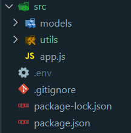
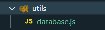
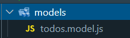

# DOCUMENTATION CRUD TODO-LIST

Este proyecto es un CRUD (Crear, Leer, Actualizar y Eliminar) de tareas desarrollado en Node.js.

Para realizar la conexión a una base de datos, vamos a usar sequelize y lo instalaremos junto a express y los controladores para postgres de la siguiente manera:

```shell
npm i express sequelize pg pg-hstore
```

## La estructura de carpetas a utilizar para tener nuestro proyecto organizado deberá tener la siguiente disposición:




## 2. Creando una conexión a la base de datos

Para crear una conexión debemos crear una instancia de Sequelize y poner los datos de conexión en el constructor. Esto lo hacemos dentro del documento database.js



```javascript
import {Sequelize} from 'sequelize';

const db = new Sequelize({
  host: 'localhost',
  port: 5432
  database: 'database_name',
  user: 'username'
  password: 'your_password',
  dialect: 'postgres'
});

export default db;
```

>**Esta instancia la importamos en app.js
y usamos el método authenticate para comprobar la conexión a la base de datos.**

## 2.1 app.js

Con el siguiente código se probará la conexión a la base de datos

```javascript
import express from "express";
import db from "./utils/database.js";

db.authenticate()
  .then(() => console.log("base de datos conectada correctamente"))
  .catch((error) => console.log(error));

// continua el código del servidor de express
// ...
```

## 3. Creando un modelo

Una vez tenemos nuestra conexión con la base de datos, vamos a crear los modelos necesarios para poder interactuar con la base de datos.

### 3.1 todos.model.js

En este archivo importaremos la instancia de Sequelize (db)
al igual que DataTypes.



Usaremos el método "define", para definir un nuevo modelo.

```javascript
import { DataTypes } from "sequelize";
import db from '../utils/database.js';

const Todo = db.define('todos', {

    id: {
        type: DataTypes.INTEGER,
        primaryKey: true,
        autoIncrement: true,
    },
    title: {
        type: DataTypes.STRING(30),
        allowNull: false, 
    },
    description: {
        type: DataTypes.STRING(500),
        allowNull: false,
    },
    completed: {
        type: DataTypes.BOOLEAN,
        allowNull: false,
        defaultValue: false,
    }
});

export default Todo;
```

## 4. Sincronizando el modelo

Sincronizar el modelo significa que vamos a comparar los modelos en sequelize con las tablas existentes en la base de datos.

para esto usaremos el método:

>**sync()**

Este método preguntará si la tabla ya existe; si no existe, la crea.

Por otro lado, Si ya existe no realiza acción alguna.

Vamos a app.js para ver la implementación =>

### app.js

```javascript
import express from "express";
import db from "./utils/database.js";
// import models here!
import Todo from "./models/todos.model.js";

Todo;

db.authenticate()
  .then(() => console.log("base de datos conectada correctamente"))
  .catch((error) => console.log(error));

// Sincroniza con la base de datos

db.sync()
  .then(() => console.log("Base de datos sincronizada"))
  .catch((error) => console.log(error));

// continua el código del servidor d express
// ...
```

**NOTA: De esta manera ya generamos una conexión a una base de datos con sequelize, creamos un modelo y lo sincronizamos en la base de datos.**

# 5. Sequelize CRUD

Para crear usando sequelize, debemos usar el método "create".
Este método es de los modelos, asi que debemos asegurarnos que al usarlo estemos trabajando con un modelo.

## 5.1 Create

```js
User.create({ ...fields });
```

Esto aplicado en una ruta de express, se vería de la siguiente forma.

Por el body de la petición

> req.body

Se enviará la información necesaria para crear el nuevo registro.

```js
app.post("/todos", async (req, res) => {
  try {
    const { body } = req;
    const todo = await Todo.create(body);
    res.status(201).json(todo);
  } catch (error) {
    res.status(400).json(error);
  }
});
```

## 5.2 Read => obtener todas las tareas

**Esta operación tiene su equivalente en SQL a:**

```sql
SELECT * FROM users;
```

En sequelize usamos el médodo:

> findAll( )

Aplicado en una ruta de express sería:

```js
app.get("/todos", async (req, res) => {
  try {
    const todos = await Todo.findAll();
    res.json(todos);
  } catch (error) {
    res.status(400).json(error);
  }
});
```

### 5.3 Obteniendo las tareas por el id:

De igual manera tenemos la opción de obtener un registro por su pk (llave primaria) en SQL:

```sql
SELECT * FROM users WHERE id={value}
```

En sequelize usaremos el metodo:

> findByPk( )

En una ruta de express sería de la siguiente manera:

```js
app.get("/todos/:id", async (req, res) => {
  try {
    const { id } = req.params;
    const todo = await Todo.findByPk(id);
    res.json(todo);
  } catch (error) {
    res.status(400).json(error);
  }
});
```

# Variables de entorno

Instalar dotenv

```shell
npm i dotenv
```

En la raíz del proyecto creamos un archivo .env

En .gitignore agregamos este archivo

```
node_modules
.env
```

En el archivo .env agregamos las varaibles de entorno para la conexión a la base de datos.

> Recuerda cambiar los valores por los tuyos.

```shell
DB_HOST=localhost
DB_USERNAME=postgres
DB_NAME=models_db
DB_PORT=5432
DB_PASSWORD=root
```

PAAS -> Platform as a Service
